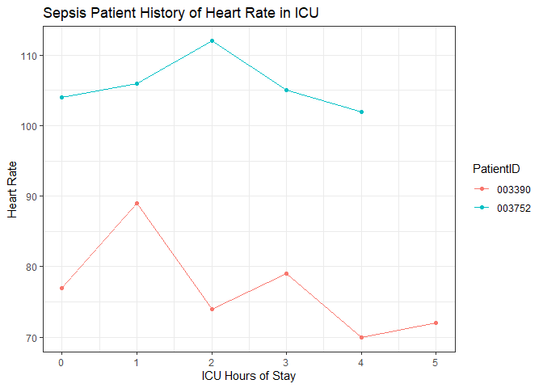
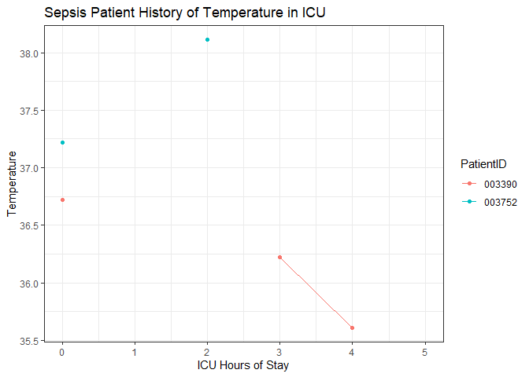
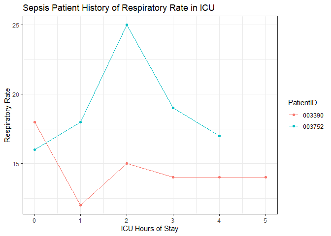

Assignment 7 - Task 3-6
================

Report Last run `r Sys.time()`

# Task 4: Make an ICU status report

## Report

This report was generated on 2023-04-08 21:09:02.

| PatientID | ICU Length of Stay | Heart Rate | Temperature | Respiratory Rate |
|:----------|-------------------:|-----------:|------------:|-----------------:|
| 003390    |                  5 |         72 |          NA |               14 |
| 003752    |                  4 |        102 |          NA |               17 |

Most recent Physio. Data For Those Who Have Sepsis

| PatientID | obsTime             | Change_HR | Change_Temp | Change_Resp | Change_HR_color | Change_Temp_color | Change_Resp_color |
|:----------|:--------------------|----------:|------------:|------------:|:----------------|:------------------|:------------------|
| 000045    | 2023-04-08 23:37:28 |        NA |          NA |          NA | yellow          | yellow            | yellow            |
| 000045    | 2023-04-08 22:39:07 |        -4 |          NA |          -1 | red             | yellow            | red               |
| 000055    | 2023-04-09 00:39:28 |        NA |          NA |          NA | yellow          | yellow            | yellow            |
| 000055    | 2023-04-08 22:39:07 |        -1 |          NA |           0 | red             | yellow            | yellow            |
| 000178    | 2023-04-08 23:58:46 |        NA |          NA |          NA | yellow          | yellow            | yellow            |
| 000178    | 2023-04-08 22:39:07 |        21 |          NA |           1 | green           | yellow            | green             |
| 000659    | 2023-04-08 22:42:39 |        NA |          NA |          NA | yellow          | yellow            | yellow            |
| 000659    | 2023-04-08 22:39:07 |         2 |       -0.50 |           0 | green           | red               | yellow            |
| 000707    | 2023-04-08 22:58:25 |        NA |          NA |          NA | yellow          | yellow            | yellow            |
| 000707    | 2023-04-08 22:39:07 |         2 |          NA |          -1 | green           | yellow            | red               |
| 000774    | 2023-04-08 23:03:50 |        NA |          NA |          NA | yellow          | yellow            | yellow            |
| 000774    | 2023-04-08 22:39:07 |         6 |          NA |          -3 | green           | yellow            | red               |
| 001263    | 2023-04-08 22:44:20 |        NA |          NA |          NA | yellow          | yellow            | yellow            |
| 001263    | 2023-04-08 22:39:07 |         4 |          NA |           2 | green           | yellow            | green             |
| 001431    | 2023-04-08 23:30:18 |        NA |          NA |          NA | yellow          | yellow            | yellow            |
| 001431    | 2023-04-08 22:39:07 |       -21 |          NA |          27 | red             | yellow            | green             |
| 001616    | 2023-04-08 23:44:34 |        NA |          NA |          NA | yellow          | yellow            | yellow            |
| 001616    | 2023-04-08 22:39:07 |       -33 |          NA |          -1 | red             | yellow            | red               |
| 001661    | 2023-04-08 22:39:48 |        NA |          NA |          NA | yellow          | yellow            | yellow            |
| 001661    | 2023-04-08 22:39:07 |         2 |        0.22 |           3 | green           | green             | green             |
| 001998    | 2023-04-08 22:43:28 |        NA |          NA |          NA | yellow          | yellow            | yellow            |
| 001998    | 2023-04-08 22:39:07 |         0 |        0.28 |           8 | yellow          | green             | green             |
| 002285    | 2023-04-08 22:45:29 |        NA |          NA |          NA | yellow          | yellow            | yellow            |
| 002285    | 2023-04-08 22:39:07 |        -4 |          NA |           1 | red             | yellow            | green             |
| 002459    | 2023-04-09 00:02:37 |        NA |          NA |          NA | yellow          | yellow            | yellow            |
| 002459    | 2023-04-08 22:39:07 |        23 |          NA |          13 | green           | yellow            | green             |
| 002526    | 2023-04-09 00:28:38 |        NA |          NA |          NA | yellow          | yellow            | yellow            |
| 002526    | 2023-04-08 22:39:07 |        14 |       -0.25 |           3 | green           | red               | green             |
| 002791    | 2023-04-08 22:51:22 |        NA |          NA |          NA | yellow          | yellow            | yellow            |
| 002791    | 2023-04-08 22:39:07 |         0 |          NA |           0 | yellow          | yellow            | yellow            |
| 002800    | 2023-04-08 23:14:45 |        NA |          NA |          NA | yellow          | yellow            | yellow            |
| 002800    | 2023-04-08 22:39:07 |         0 |        0.50 |           0 | yellow          | green             | yellow            |
| 002958    | 2023-04-08 23:00:02 |        NA |          NA |          NA | yellow          | yellow            | yellow            |
| 002958    | 2023-04-08 22:39:07 |        NA |          NA |          NA | yellow          | yellow            | yellow            |
| 003289    | 2023-04-08 23:35:45 |        NA |          NA |          NA | yellow          | yellow            | yellow            |
| 003289    | 2023-04-08 22:39:07 |        -3 |          NA |           0 | red             | yellow            | yellow            |
| 003365    | 2023-04-08 22:39:07 |        NA |          NA |          NA | yellow          | yellow            | yellow            |
| 003390    | 2023-04-08 22:47:32 |        NA |          NA |          NA | yellow          | yellow            | yellow            |
| 003390    | 2023-04-08 22:39:07 |        12 |          NA |          -6 | green           | yellow            | red               |
| 003541    | 2023-04-08 22:39:38 |        NA |          NA |          NA | yellow          | yellow            | yellow            |
| 003541    | 2023-04-08 22:39:07 |       -10 |          NA |          -5 | red             | yellow            | red               |
| 003752    | 2023-04-08 23:31:55 |        NA |          NA |          NA | yellow          | yellow            | yellow            |
| 003752    | 2023-04-08 22:39:07 |         2 |          NA |           2 | green           | yellow            | green             |
| 004495    | 2023-04-08 22:50:37 |        NA |          NA |          NA | yellow          | yellow            | yellow            |
| 004495    | 2023-04-08 22:39:07 |         4 |          NA |           5 | green           | yellow            | green             |
| 004538    | 2023-04-08 23:41:31 |        NA |          NA |          NA | yellow          | yellow            | yellow            |
| 004538    | 2023-04-08 22:39:07 |         9 |          NA |           6 | green           | yellow            | green             |
| 004544    | 2023-04-09 00:28:12 |        NA |          NA |          NA | yellow          | yellow            | yellow            |
| 004544    | 2023-04-08 22:39:07 |         4 |        0.50 |           0 | green           | green             | yellow            |
| 004871    | 2023-04-08 23:30:26 |        NA |          NA |          NA | yellow          | yellow            | yellow            |
| 004871    | 2023-04-08 22:39:07 |        -3 |          NA |          -5 | red             | yellow            | red               |
| 005083    | 2023-04-08 23:54:50 |        NA |          NA |          NA | yellow          | yellow            | yellow            |
| 005083    | 2023-04-08 22:39:07 |         6 |          NA |           5 | green           | yellow            | green             |
| 005156    | 2023-04-09 00:16:39 |        NA |          NA |          NA | yellow          | yellow            | yellow            |
| 005156    | 2023-04-08 22:39:07 |        -4 |       -0.33 |           2 | red             | red               | green             |
| 005200    | 2023-04-08 23:26:57 |        NA |          NA |          NA | yellow          | yellow            | yellow            |
| 005200    | 2023-04-08 22:39:07 |        -8 |          NA |          -2 | red             | yellow            | red               |
| 005370    | 2023-04-08 23:05:37 |        NA |          NA |          NA | yellow          | yellow            | yellow            |
| 005370    | 2023-04-08 22:39:07 |        -1 |          NA |           8 | red             | yellow            | green             |
| 005548    | 2023-04-08 23:16:04 |        NA |          NA |          NA | yellow          | yellow            | yellow            |
| 005548    | 2023-04-08 22:39:07 |         0 |          NA |          -1 | yellow          | yellow            | red               |
| 005607    | 2023-04-08 23:54:03 |        NA |          NA |          NA | yellow          | yellow            | yellow            |
| 005607    | 2023-04-08 22:39:07 |         0 |          NA |          -1 | yellow          | yellow            | red               |
| 005756    | 2023-04-08 23:56:52 |        NA |          NA |          NA | yellow          | yellow            | yellow            |
| 005756    | 2023-04-08 22:39:07 |        -8 |          NA |           0 | red             | yellow            | yellow            |
| 005855    | 2023-04-08 23:29:29 |        NA |          NA |          NA | yellow          | yellow            | yellow            |
| 005855    | 2023-04-08 22:39:07 |        -1 |          NA |          -5 | red             | yellow            | red               |
| 005857    | 2023-04-09 00:13:57 |        NA |          NA |          NA | yellow          | yellow            | yellow            |
| 005857    | 2023-04-08 22:39:07 |       -10 |          NA |           2 | red             | yellow            | green             |
| 006114    | 2023-04-08 22:54:14 |        NA |          NA |          NA | yellow          | yellow            | yellow            |
| 006114    | 2023-04-08 22:39:07 |         9 |          NA |          -1 | green           | yellow            | red               |
| 006391    | 2023-04-08 23:23:06 |        NA |          NA |          NA | yellow          | yellow            | yellow            |
| 006391    | 2023-04-08 22:39:07 |         1 |          NA |           0 | green           | yellow            | yellow            |
| 007257    | 2023-04-08 23:16:15 |        NA |          NA |          NA | yellow          | yellow            | yellow            |
| 007257    | 2023-04-08 22:39:07 |        -5 |        0.10 |          -1 | red             | green             | red               |
| 007566    | 2023-04-08 22:39:07 |        NA |          NA |          NA | yellow          | yellow            | yellow            |
| 007766    | 2023-04-08 23:23:22 |        NA |          NA |          NA | yellow          | yellow            | yellow            |
| 007766    | 2023-04-08 22:39:07 |         5 |          NA |           1 | green           | yellow            | green             |
| 008199    | 2023-04-08 23:26:03 |        NA |          NA |          NA | yellow          | yellow            | yellow            |
| 008199    | 2023-04-08 22:39:07 |         6 |          NA |           1 | green           | yellow            | green             |
| 008292    | 2023-04-08 22:39:30 |        NA |          NA |          NA | yellow          | yellow            | yellow            |
| 008292    | 2023-04-08 22:39:07 |        -5 |          NA |           1 | red             | yellow            | green             |
| 008663    | 2023-04-08 22:39:07 |        NA |          NA |          NA | yellow          | yellow            | yellow            |
| 008931    | 2023-04-08 23:03:10 |        NA |          NA |          NA | yellow          | yellow            | yellow            |
| 008931    | 2023-04-08 22:39:07 |         5 |          NA |           1 | green           | yellow            | green             |
| 008994    | 2023-04-08 23:53:02 |        NA |          NA |          NA | yellow          | yellow            | yellow            |
| 008994    | 2023-04-08 22:39:07 |         1 |          NA |           2 | green           | yellow            | green             |
| 009322    | 2023-04-08 23:12:27 |        NA |          NA |          NA | yellow          | yellow            | yellow            |
| 009322    | 2023-04-08 22:39:07 |       -12 |          NA |           0 | red             | yellow            | yellow            |
| 009379    | 2023-04-08 22:47:34 |        NA |          NA |          NA | yellow          | yellow            | yellow            |
| 009379    | 2023-04-08 22:39:07 |        -6 |          NA |           0 | red             | yellow            | yellow            |
| 009583    | 2023-04-08 22:40:21 |        NA |          NA |          NA | yellow          | yellow            | yellow            |
| 009583    | 2023-04-08 22:39:07 |        -2 |       -0.10 |           0 | red             | red               | yellow            |
| 009813    | 2023-04-08 22:57:07 |        NA |          NA |          NA | yellow          | yellow            | yellow            |
| 009813    | 2023-04-08 22:39:07 |         2 |          NA |           9 | green           | yellow            | green             |
| 009851    | 2023-04-09 00:24:31 |        NA |          NA |          NA | yellow          | yellow            | yellow            |
| 009851    | 2023-04-08 22:39:07 |        10 |          NA |           1 | green           | yellow            | green             |
